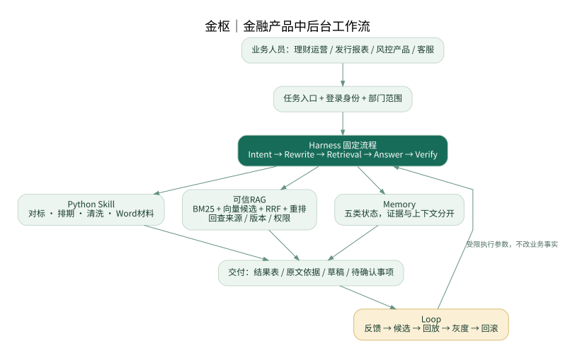
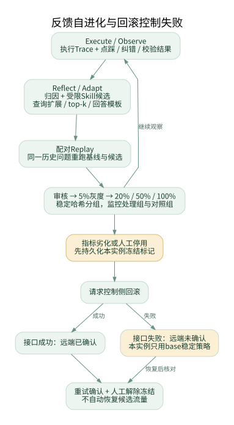

# 金枢｜金融中后台 Agent

**可信 RAG · 可执行 Skill · 反馈驱动的流程自动化**

把资料问答、理财工具、发行支持和反馈复盘放进同一个工作台。基于既有 Agent 工程与 Python 方法的个人 AI 辅助改造项目；不是学校委托或实习公司的正式上线系统。

## 直接体验

### [打开金枢工作台 → jinshu-workbench.vercel.app](https://jinshu-workbench.vercel.app)

**V6已在上述真实网址完成浏览器操作与100题带出处开发验收。** [实际网站运行](https://github.com/cxy-peter/jinshu-fintech-agent/actions/runs/35405427350) · [100题答案与原文证据](evidence/v6-production/vercel100.json) · [追加功能验收](evidence/v6-extra/result.json)

[产品岗简历与介绍](docs/V6_RESUME_PRODUCT.md) · [产品与验收说明](docs/V6_ACCEPTANCE_AND_PRODUCT.md) · [原ZIP/pi/视频对照](docs/V6_SOURCE_ALIGNMENT.md) · [产品面试问答](docs/V5_INTERVIEW.md) · [操作指南](docs/V5_GUIDE.md) · [完整服务部署](docs/V4_GUIDE.md)

| 业务入口 | 可操作结果 |
|---|---|
| 金融学习与资料问答 | 56个原创学习主题；自动路由、短追问、引用与原文；可导入自己的完整资料 |
| 上传与知识维护 | PDF、DOCX、文本、CSV、分页JSON、切片ZIP；来源、页码、待审/启停、全文查看 |
| 理财与发行 | 产品对标、发行排期、周报质检、材料生成；实际计算并导出CSV、JSON、Word |
| 风险与运营 | 开户字段时点、案件邮件核查、禁用策略候选、模拟三表；不执行真实账户或资金操作 |
| 反馈与复盘 | Trace、记忆视图、失败归因、候选回放、确认生效与回滚 |
| 验收与体验 | 100题可自行重跑并导出答案及出处；体验表单默认标记测试数据 |

## 一、普通网页的原理

```text
公开/本人上传资料 → 原生解析 → 页码与分块 → 本地审核开关 → 词项倒排索引
问题 → 规则路由/短追问补全 → BM25与标题权重 → 有效来源/有界邻块展开
     → 原文组织 → 引用身份、位置与逐字一致性检查 → 答案/Trace
反馈 → 归因分类 → 查询词/top-k候选 → 同一历史问题回放 → 确认/回滚
```

默认使用中文分词、双字补充与BM25。目录页降权、正文标题加权；跨页补充保留独立来源ID，不冒充额外top-k命中。三表+周报问题可拆两个受限资料子任务。11类工作流入口中有8类固定业务工具实际执行函数。

**默认答案是有出处的检索整理，不是LLM生成，也没有语义Embedding。** 每条依据展示资料名、页码、版本和原文摘录。内置金融内容是本项目的学习提要，引用时不伪装成教材逐字原文；本人导入原笔记后，才引用其提取原文。

文件和反馈保存于访问者自己的IndexedDB，不共享给其他访客；本地启用不等于企业多人审核。可选 `/api/answer` 需要部署者配置模型与访问码，并取得访问者发送当前问题/片段的许可。本轮实际网站该模型入口返回503“未启用”，主功能仍可使用。

## 二、完整部署版的原理

```text
FastAPI / 用户与部门范围
  → MemoryContextBuilder（权限、时效、权威级别、上下文预算）
  → Intent → Rewrite → Retrieval → Answer → Verify → Trace
                         ↓
    BM25 + Milvus候选 → RRF → Mongo有效正文回查 → Reranker
                         ↓
                   模型生成 / 验证 / 分级降级
Redis Stream / Worker → Observe → Reflect → Adapt → Replay → 审核/灰度/回滚
```

Mongo维护事实正文、版本、有效状态和作业；Milvus是可重建候选索引；Redis负责会话与消息流。五类Memory区分工作、情景、用户、组织知识和程序策略，不能把历史摘要当制度依据。pi负责允许节点的概率性执行，Harness控制顺序、工具、预算和证据条件。

原工程的后端、Next.js和pi目录保留；金融适配位于 `jinshu/`。V6另加 **pi运行overlay**：超时请求abort、仅取最终assistant文字、严格单值JSON。真实pi包的合同测试通过，但测试provider是合成流，不等于真实模型端到端验收。

| 故障 | 回退方式 |
|---|---|
| Query Embedding / Milvus不可用 | 仅关键词检索，不以hash假扮同一语义空间 |
| Reranker不可用 | 返回融合/词项排序，记录降级 |
| 生成不可用 | 返回明确标记的原文，不伪造生成结果 |
| 事实有效状态不能确认 | 暂停受保护答案，不能降低事实标准 |
| 候选需回滚但远端未确认 | 保留冻结/未确认状态，稳定策略兜底，恢复后核对 |

## 工作流与反馈图

每行一张；已修正SVG内部1.81倍缩放与画布不一致导致的裁切，并确认整图可见。点击原图放大。图展示完整工程设计，不能据图推断网页运行了全部服务器组件。

<p><a href="diagrams/01_architecture.svg"></a></p>

<p><a href="diagrams/03_loop.svg"></a></p>

## 100题如何验收

56概念题、20改写题、16业务精确信息、2追问、2多来源题、4无依据题。标签在规则迭代前固定；问答模块不读取标签，单独评测模块才读取。每题检查路由、指定来源、关键点覆盖和原文引用；不是只看页面返回200。

| 实际网站结果 | 数值 |
|---|---:|
| 联合开发验收通过 | 100 / 100 |
| 有依据问题 | 96 |
| 指定来源Hit@5 / labeled Recall@5 | 100% / 100% |
| MRR@5 | 0.9766 |
| 有依据回答的原文一致性核验 | 96 / 96 |
| 正确说明无依据 | 4 / 4 |
| 组件程序测试 | 48条通过 |

**这是自编、单一设计者、指定语料的开发验收，不是独立盲测、穷尽相关性标注、LLM生成准确率或真实用户效果。** 原文一致不等于结论全部语义正确。答案、引用、原始记录和构建哈希均可复核。真实用户试点仍为0。

追加实站检查覆盖偏好刷新保留、体验记录撤回、CSV计算与导出、切片ZIP导入、重复文件去重、原文定位、资料停用和工作区导出清空。[运行记录](https://github.com/cxy-peter/jinshu-fintech-agent/actions/runs/35406081464)

## 部署与后续更新

普通网页：Vercel Import本仓库时 Root=`lite`、Framework=`Other`、Install=`npm ci`、Build=`npm run build`、Output=`dist`、Node=22；不需默认模型密钥。本机预览：

```bash
cd lite
npm ci && npm run build
python -m http.server 8795 --directory dist
```

当前实际站点由单独的 `jinshu-workbench` 发布仓库连接Vercel。其构建固定读取已通过测试的上游提交 `925f698cf8c9c12a644fd545cfb4bd145770b248` 并逐文件核验SHA-256；不会悄悄跟随可变main。下次更新需修改发布仓库的固定提交/哈希清单。`build-info.json`可核对实际部署来源。本次后续文档修订不改变线上已验收代码。

完整服务：

```bash
python scripts/init_deployment.py
docker compose --env-file deploy/compose/.env -f deploy/compose/stack.yml --profile local-models up -d --build
# 可选pi运行补丁：额外加 -f deploy/compose/pi-v6.yml 和 --profile pi
```

先按V4指南创建账户、审核资料与设置私有模型。单机Compose不等于高可用；不要把CI的 `down -v` 用于需保留数据的服务器。

<details>
<summary>完整服务历史验收、原工程与尚未验证项</summary>

V4实跑了Mongo/Redis/Milvus、8个模拟PDF/34切片入库和Qwen/BGE/Reranker调用；完整CI随后在评测导入处失败，真实pi最终验收与24题评测未完成，部分生成候选曾被Verifier阻止。V6网页及pi合同测试成功不替代这些缺项。

K8s/HPA/k6为待执行容量方案，不是20Pod成绩。原ZIP231文件中公开engine保留218个，216个字节一致，2个为已说明的V3补丁。pi目录18个文件全部一致，包含16个非隐藏文件和2个隐藏配置；新增overlay不改原件。视频复核10个关键时间点，未逐字转写全部音频。私人90份资料/19032片预处理不随公共站点发布。

</details>

`lite/` 网页；`jinshu/` 金融适配；`engine/` 原工程；`services/pi-agent-overlay/` pi适配；`deploy/` 部署；`docs/` 文档；`evidence/` 实测记录。模型权重、字体文件、密钥、公司截图和私人原文不放公共代码包。
