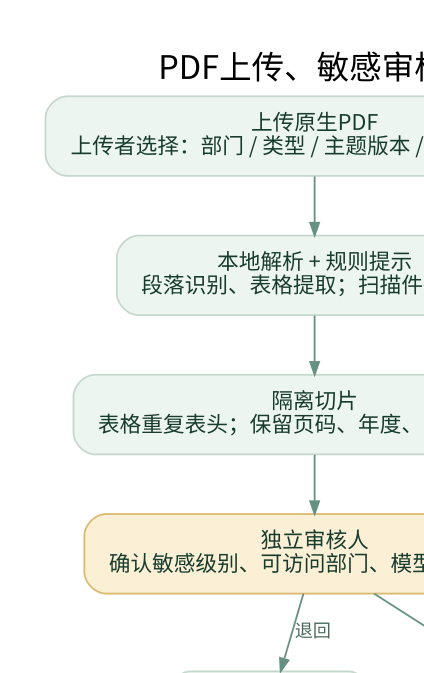
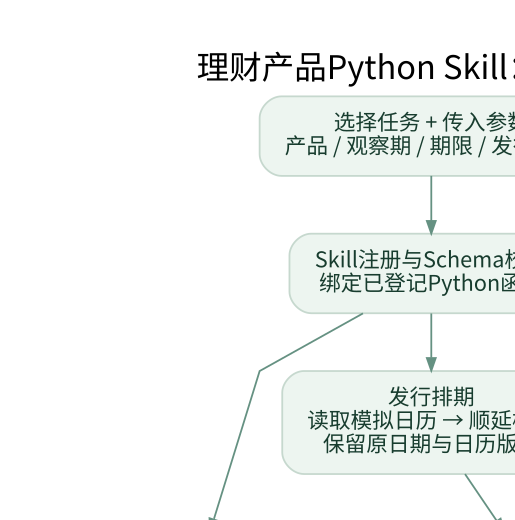

# 金枢 V3｜产品架构与运行手册


## 01 项目定位：从实习问题到独立作品

金枢｜金融产品中后台自进化 Agent，是源于理财运营自动化、数字资产业务客服与核查需求的个人改造原型。它面向产品运营、客服支持、发行报表和风控产品人员，不是假设两家公司的内部系统实际打通。

统一场景是“中后台人员收到一个问题或材料任务，需要找对资料、执行已有工具、交付可核对的结果，并把失败转成可验证的改进”。产品对标、客服制度查询和案件核查共享身份、知识、Trace、Memory及Loop，但各自有部门范围、数据和工具。

### 简历应放哪里

单列“个人项目”，标题后注明“实习场景延伸／个人原型”。实习条目只写当时实际做过的需求、工具和验收。本次增加的敏感审核、PDF流程和Loop不能回填成公司已上线成果。参考学校的组织合作身份、用户数和性能数字也不能借用。

|工作区|典型任务|交付物|
|---|---|---|
|产品运营|净值对标、发行排期、材料生成|可比数据、排期草案、Word草稿|
|客服与风控支持|FAQ/SOP、字段时点、案件核查|带来源说明、异常清单、人工待办|
|共用能力|知识版本、权限、Memory、Loop|可追溯执行、候选回放、灰度及回滚|

业务数据、制度和日历均为明确标注的模拟。没有调用实际公司的账户、Captcha、邮件、工单、付款或交易接口。


## 02 原工程与界面：保留底座，新增适配

完整本地包保留原engine目录的231个文件：229个字节级不变，2个为V2已有的明确补丁，本轮没有继续修改原文件。新代码位于jinshu/，补丁说明和原始哈希在patches/与evidence/。原ZIP/RAR不变。

原Next.js界面、Node pi服务、Harness、Memory、Loop、Mongo/Redis接口和部署目录保留。当前可直接运行的金融工作台使用原配色与布局风格：深绿侧栏、金色选中标记、白色卡片。它不是原Next.js页面未经改动就完成金融接口联调；原页面仍在engine/web供对照。

工作台截图见随附Word手册。

公开GitHub仅导入程序、测试、配置和模拟材料；参考包中的学校原始文档、设计图片及个人简历不公开。公开保留清单与完整本地保留检查分开，不能把主动排除称为文件丢失。


## 03 Harness：流程控制与模型推理分工

沿用Intent → Rewrite → Retrieval → Answer → Verify主链，加载五层记忆并执行已注册的Python工具。输入、工具输出、命中策略、来源、降级及耗时进入Trace。模型不得任意跳过检索、执行新代码或改写财务账本。


数字由确定性工具处理；模型接口用于可选推理与文字整理。Verify失败只定向重写答案，最多两次，不为了重试回答而重复执行有副作用的工具。最终无法通过时返回有权限的原文或明确不足。来源存在不等于所有语义结论正确。


## 04 PDF入库：审核要在模型外发之前

本轮生成8份原生PDF：资产负债表、利润表、现金流量表、产品材料、发行SOP、公共FAQ、开户SOP、敏感交接案例。前三张表取自同一份模拟数据，不在PDF里另编不一致的数字。

上传者先填部门、主题、版本、敏感等级。程序在本机读取文字、表格并作规则检测，仅返回匹配规则类别，不在检测摘要回显联系方式等匹配原文。待审内容进入隔离状态，不调用外部Embedding，不进入共享检索。



另一位审核人确认等级、部门和外发许可；降低风险建议须给理由，敏感提示不能通过一个勾选框直接外发。通过审核之后才准备索引并切换有效版本。向量索引失败会明确发布为BM25-only；新版本在可用索引准备完成后才切换有效头，随后归档旧版。当前不是多库事务，发布阶段发生故障仍需重试或人工处理。


## 05 PDF检索测试与敏感资料边界

|测试对象|本轮实测|不代表|
|---|---|---|
|8份原生PDF|33个切片，其中5个表格切片|任意版式或扫描PDF都能正确解析|
|PDF来源检索|6个固定查询命中对应PDF来源，包含源页|全面问答准确率或独立评测集|
|知识新旧版本|保留原有新版本替换与来源回查测试|跨Pod分布式事务已解决|
|敏感与权限|未审、越权、低密级请求被拦截|已达到任何正式合规认证|

表格切片保留表名、表头、公司、年度、单位、合并口径和源页。数字计算仍读受控结构化数据，检索用于找说明和证据。不能让语言模型读取一张表后随意改变财务数值。

敏感等级有Public、Internal、Restricted、Sensitive四档。手工声明和自动检测只是输入，审核决定发布权限；部门管理员也只能处理其有权管理的部门。规则会误报和漏报，不能宣称自动判断准确率。

工作台默认不启用模型生成。文档审核中的外发许可控制文档向量化、远端重排与答案生成的资料使用；真实服务模式仍需单独联调查询改写、记忆和外部服务的数据流，不能把离线检查当作已完成企业数据外发审核。

### 没有自动OCR

本轮只处理原生PDF。扫描件或空文本标为需要人工处理，不会暗中OCR、跳过审查或把空文档作为成功入库。未做企业级DLP、加密存储和跨节点撤销传播。


## 06 Loop：自进化必须影响下一轮

沿用原LoopEngine.run_cycle与SkillMiner。反馈进入Observe，Reflect把问题分为retrieval、intent、generation、knowledge_gap；前三类可提出执行策略候选，知识缺口应请人补资料，不允许模型编造制度。


本轮保持20条历史请求配对重新执行。离线实验中，对照top-k为2、处理组为8，查询词和模板变化，而财务计算保持不变。候选经过审核、5%灰度、20%扩量与故障注入回滚。反馈和流量为合成，仅证明机制接通，不证明质量提高。


## 07 降级：功能可以减少，权限不能放宽

|故障|实际回退／控制|禁止的说法|
|---|---|---|
|回滚控制API失败|先持久化冻结候选，稳定基线接续；状态local_baseline_remote_unconfirmed|显示已全局回滚成功|
|权威状态库不可读|不从旧权限缓存继续回答；返回服务错误|用旧权限或旧文档缓存照答|
|Milvus/查询Embedding失败|BM25检索，仍回查权威源|已缓存文档向量就无需查询向量|
|Reranker/生成失败|保留安全顺序或原文，标记降级|把规则摘录伪装成模型总结|
|身份/Captcha失败|截图为产品参考；本原型未接实际账户或Captcha服务|跳过验证让游客查询账号|
|工单接口超时|保存本地幂等草稿pending_submission，无确认ID不算提交|假定对方已受理并丢弃请求|
|Redis或作业依赖失败|不宣称持久化成功，Loop冻结或重试|悄悄用内存替代生产消息保证|

### 回滚本身失败的实测

测试先执行候选top-k=8，再注入远端回滚故障。本机先落盘冻结标记，返回local_baseline_remote_unconfirmed；下一次执行使用稳定基线top-k=2，计算结果不变。重建Runtime后仍读到冻结。管理员应在远端回滚确认后再解除冻结；自动恢复及跨节点统一控制尚未实现。

本机开关只约束该节点。若整个API或进程不可达，客户端不能证明冻结已写入，需要网关或进程监管层停流。跨Pod传播、控制面租约和一致性还未实现；不能把这个本机测试说成集群容灾。


## 08 Python Skills：旧方法变成可用任务

|入口|参数与检查|实际输出|
|---|---|---|
|wealth_benchmark|产品、起止日期，可比口径和共同区间|收益/回撤、样本对照|
|issuance|起点、期限、周/双周、批次数|日历约束下的排期草案|
|weekly_report|固定源文件、主键与字段检查|标准行、缺数和重复异常|
|material_fill|产品Schema、必需要素、幂等文件名|真实生成Word草稿，记录文件哈希|



REGISTRY明确指向Python函数和参数Schema。它不是允许用户上传任意.py文件执行的入口。工具记录函数路径和源文件哈希；模拟材料生成不修改原模板，不发邮件，不自动发行。其余开户、案件、策略预检、三表、客服工作流继续复用原适配，共9类。


## 09 运行、服务配置与阅读顺序

```text
python -m venv .venv
.venv\Scripts\python.exe -m pip install -r requirements.txt
.venv\Scripts\python.exe -m jinshu.mock_pdfs
.venv\Scripts\python.exe -m jinshu serve --port 8766
```

Windows也可运行start_local.bat；macOS/Linux使用source .venv/bin/activate，然后python -m jinshu serve。浏览器打开http://127.0.0.1:8766。默认只监听本机，公开演示账号不得部署公网。

editor/demo-editor上传；reviewer/demo-reviewer独立复核。先执行发行排期，再去“资料与切片”载入8份PDF，换reviewer完成分类审核及发布。最后进入Loop实验室、故障与回退、流程图谱。

|层|现状|
|---|---|
|原Harness、Memory、Loop、BM25/RRF|本地运行和回归测试|
|PDF表格、分类审核、Python Skill、持久化冻结|本轮新增并测试|
|MilvusClient、Redis接管、pi/模型候选接口|代码/契约路径；真实服务未联调|
|Mongo/Redis服务、真实Embedding/Reranker/生成|需本机配置和授权；本轮未真实调用|
|K8s/HPA/Prometheus部署|保留源配置；未部署、未做吞吐压测|

离线模式用原内存事实存储、hash向量和规则/原文回退。hash不是语义模型；内存事实重启后重建。仅安全冻结和工单草稿本轮新增本机持久化。services模式见profiles/，先验证权限与模型外发政策，再使用已授权服务。


## 10 发布、验收与下一阶段

新仓库为cxy-peter/jinshu-fintech-agent。公开源代码与完整本地原包分别维护：GitHub不公开学校原始资料、上传的公司截图、个人简历、视频、真实密钥与运行数据库。保留原作者说明，不自行给未确认许可的参考代码重新授予开源许可证。

```text
python -m pytest -q
python scripts/validate_v3.py
python scripts/verify_source.py
python scripts/build_diagrams.py
```

本轮测试数字以evidence/v3_validation_summary.json和压缩包复测记录为准。当前123项程序测试通过，2项原测试因缺少pymongo跳过，不计入通过。测试覆盖既有逻辑与本轮业务主流程，没有扩展安全专项。

界面验证方式与结果以evidence/v3_ui_checks.json为准；本地浏览器检查不能代替真实用户试点或公网部署验收。

### 优先级

先在已授权环境联调真实Mongo、Redis、Milvus、Embedding和pi；补独立标注的检索/生成验收集；再做跨节点安全开关与版本CAS、脱敏及保留策略。最后开展小范围真实用户试用，记录从任务进入到人工复核完成的总时间、返工和采用率。不要先添加更多Agent来掩盖数据或权限问题。

外部概念参考：FastAPI文件上传、Milvus Lite、Redis XAUTOCLAIM官方文档。参考材料的原始指标与案例叙事只作为阅读材料，不作为金枢成果。

